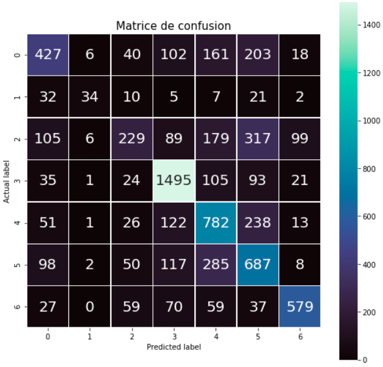

# Détection des émotions par les expressions faciales

## Objectif du projet

L'objectif de ce projet est de détecter les émotions à l'aide d'un réseau de neurones convolutif.

Il faut être capble d'utiliser une webcam pour détecter l'émotion de la personne devant la caméra et l'afficher.

## Création du modèle

Nous avons à disposition un dataset contenant 35k images (28k pour le train et 7k pour le test) afin d'entrainer le modèle à reconnaitre les émotions entre 7 classes différentes:

- Surprise
- Sad
- Neutral
- Happy
- Fear
- Disgust
- Angry

J'ai utilisé le module keras afin de créer un réseau qui resemble à ça:


Il contient une alternance de couches de ```Conv2D```, de ```MaxPooling``` et de ```Dropout```. Nous finissons avec un ```Flatten``` et quelques couches ```Dense```.

J'ai fais un premier entrainement avec l'optimizer ```Adamax``` sans paramètres particulier. Après 100 epoch, le modèle a donné une accuracy de 59%.

J'ai donc entrainé le même modèle une deuxième fois avec des un learning rate plus bas. J'ai au final eu une accuracy de 69% que j'ai choisi de garder.

## Résultats

Le modèle nous donne une accuracy de 69% sur les 7k images de test du dataset. Nous pouvons donc observer cette matrice de confusion.



La détection avec la caméra est utilisable avec le fichier [camera.py](camera.py).